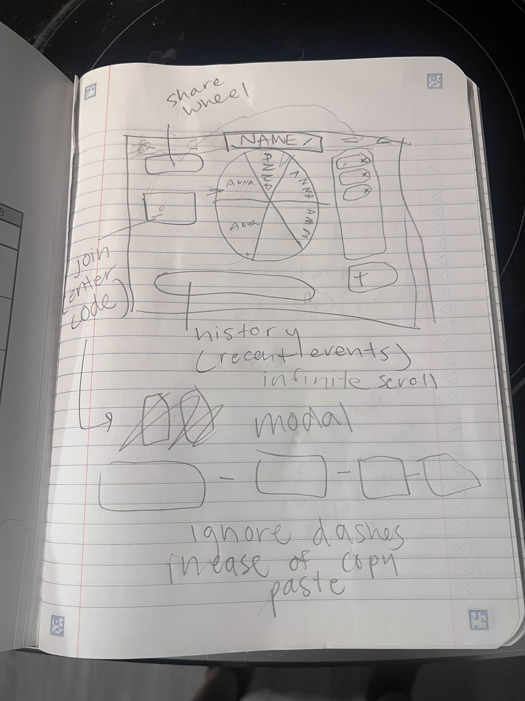
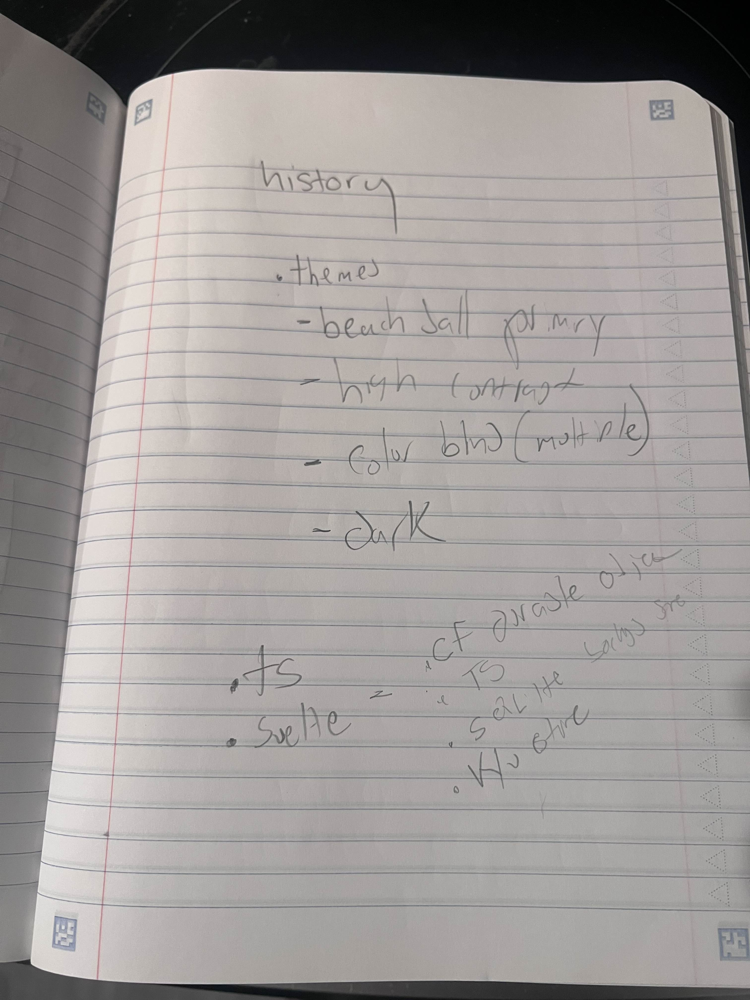

# Day One (2025-09-15)

We talked through, and drew a design for, the happy path user journey!

A minimum version would:

- Be able to create a new wheel
  - With however many entries (names) they want
- Be able to spin the wheel
- See an "event log"
  - tracks who was selected from each spin, and when names are manually added/removed
- Be able to get to a wheel by entering a join code
  - Join codes will be phrases like `smelly-cow-goes-inside`, so they're easy to say on a call
  - They should also work via URL (e.g. `example.com/smelly-cow-goes-inside`)

Some ideas were thrown around for tech choices as well. We're currently
leaning towards Cloudflare's Developer Platform as it:

- Has support for highly-available, simple, stateful functions for the wheel's state (Durable Objects)
- Has a slick integration with GitHub
- Has a generous free tier
- and also we'd both like to learn more about the platform

## Physical artifacts 📸

